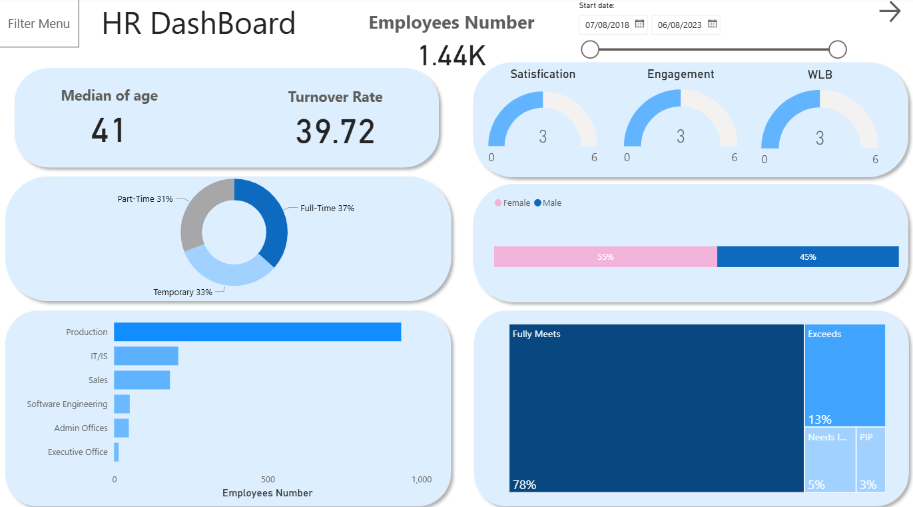
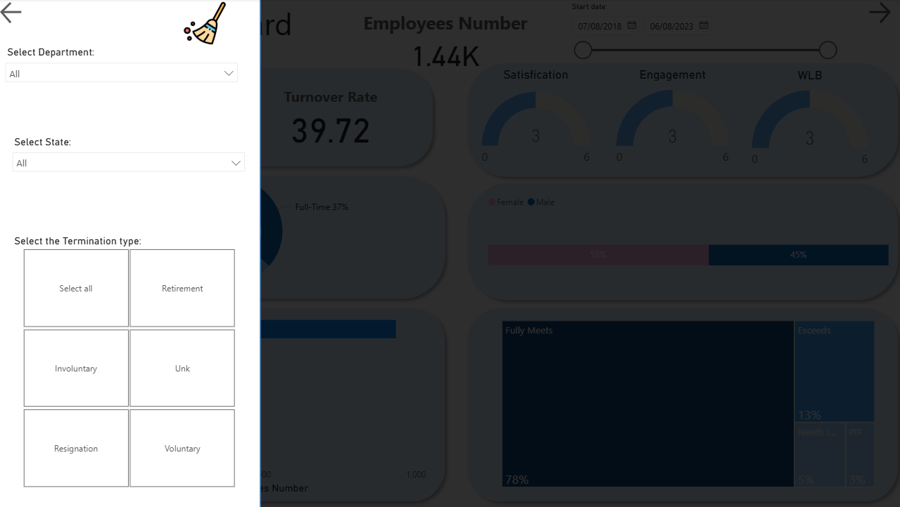
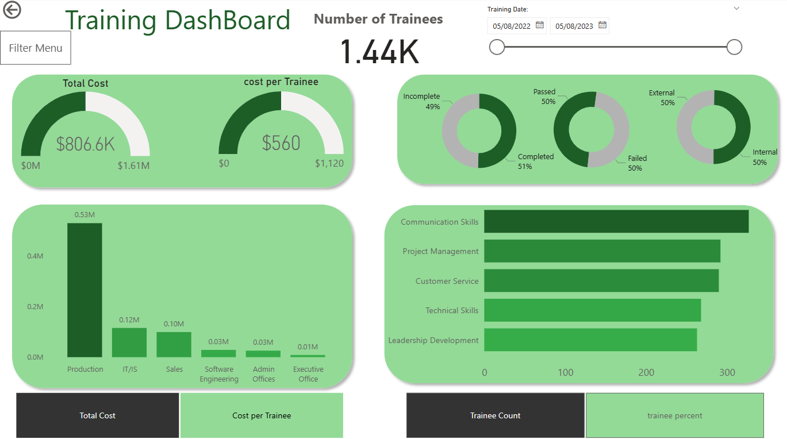

# HR Analytics Project

It is End-to-End HR Data Analysis Using SQL, Python, and Power BI.

Data source: https://www.kaggle.com/datasets/ravindrasinghrana/employeedataset/data

## Overview:

This project demonstrates a full HR Analytics workflow — from raw data to business insights.
Using PostgreSQL, Python (Pandas, Matplotlib, Seaborn, Scipy), and Power BI, it covers every stage of a data project:

1. Database design and cleaning

2. Exploratory data analysis (EDA)

3. Interactive dashboards and reporting

The aim is to provide HR leaders with actionable insights into employee demographics, performance, attrition, and training effectiveness.

## Tools & Technologies

- SQL: PostgreSQL, PL/pgSQL

- Python: Pandas, NumPy, Matplotlib, Seaborn, SciPy

- Power BI: Dashboard design and visualization

- Environment: Jupyter Notebook / pgAdmin

## Part 1 – SQL Data Modeling & Cleaning:

### 1. Schema Design

Created a dedicated schema hr_department containing:

Main Tables:

- employees

- engagement_survey

- recruitment_data

- training_and_development

Lookup Tables:

- department_type, performance, payzone_name, termination_type,
  employee_status, employee_type, training_program_name

### 2. Data Import

Raw .csv files imported using PostgreSQL’s \copy command.

### 3. Data Cleaning

Custom PL/pgSQL functions automated cleaning:

- `see_duplicates();`
- `delete_duplicated();`

- Removed duplicates and invalid date ranges (startdate > exitdate)

- Handled placeholder phone numbers (###... → NULL)

- Marked employees aged 60+ as voluntarily terminated

### 4. Normalization & Constraints

Linked categorical values to lookup tables via foreign keys

Replaced text columns with ID references using:

`give_id_and_remove_names();`

Added:

- Primary & foreign keys

- Unique constraints for emails & phone numbers

- Check constraints (score range 1–5, valid genders, etc.)

### 5. Derived Fields

Added computed column:

`ALTER TABLE employees ADD COLUMN age INT;`
`UPDATE employees SET age = EXTRACT(YEAR FROM AGE(dob));`

## Part 2 – Python Exploratory Data Analysis

### 1. Data Preparation:

Cleaned and merged HR datasets using Pandas for:

- Employees

- Engagement survey

- Training and development

### 2. Exploratory Insights:

Key descriptive analyses:

- Age Distribution: Median age = 41

- Gender Split: **55% female, 45% male**

- Employee Type: **37% full-time, 31% part-time, 33% temporary**

- Performance: **78% “Fully Meets,” 13% “Exceeds,” 8% below standard**

Statistical Tests:
| Test | Purpose | Result |
| ------------------------- | --------------------------------------------------- | ---------------------------- |
| **Kruskal–Wallis H-test** | Check differences in engagement between departments | Significant difference found |
| **Spearman Correlation** | Relationship between engagement and satisfaction | Positive correlation |
| **T-test / Mann-Whitney** | Compare engagement by gender | No significant difference |
| **Chi-Square Test** | Relationship between performance and department | Statistically significant |

### 3. Business Insights:

- Engagement varies significantly by department, indicating uneven workplace experience.

- Satisfaction and engagement are positively correlated — boosting one can improve the other.

- Turnover rate = 39.7%, driven mainly by temporary contracts and lower engagement scores.

- Older employees (55+) show higher voluntary termination rates.

- Training programs improve satisfaction when completed successfully.

## Part 3 – Power BI Dashboards:

### Key Metrics:

- Employees

- Median Age

- Turnover Rate

- Satisfaction, Engagement, WLB median score

### Visual Highlights

- Employee type breakdown (Full-time , Part-time , Temporary )

- Department distribution (Production largest segment)

- Gender ratio

- Performance overview

### Training Dashboard

### Key Metrics

- Total Training Cost

- Cost per Trainee

- Completion Rate

- Pass Rate

- Internal vs External Training

### Visual Highlights

- Department-wise training cost (Production highest investment)

- Top programs: Communication Skills, Project Management, Customer Service

- Balanced split between internal and external training sessions

## Summary

Stage Tool Purpose

1. Data Cleaning & Modeling PostgreSQL Schema design, constraint enforcement

2. Data Exploration & Statistics Python Pattern discovery, statistical testing

3. Data Visualization Power BI KPI monitoring, interactive dashboards

### Key Takeaways:

1.  SQL Layer: Built a normalized, constraint-driven HR database with data integrity.

2.  Python Layer: Performed statistical and visual EDA for actionable insights.

3.  Power BI Layer: Delivered executive-level dashboards tracking HR and training KPIs.

4.  Business Outcome: Identified drivers of turnover and engagement gaps, enabling data-driven HR decisions.
